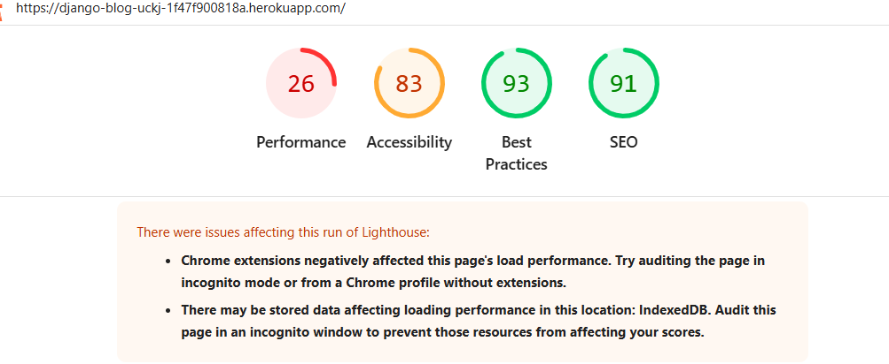

### Testing

### Manual Testing

Local manual testing passed, all CRUD operations are working as intended.

Deployed manual testing passed, all CRUD operations and logins and logouts are working as intended.

### User

There are different user types:

1. Unregistered users: Here users do not interact with databases but only register their interest and the database stores their information.
2. Registered Users: Here users interact very well with databases.

### Validation Testing

#### HTML and CSS Validation

Django HTML seems fine

#### Lighthouse/ Accessibility testing

Here is such results when incognito is not used

Here is such results when incognito is used

Due to backend capabilities, the testing results from here can be accepted as good.

#### Python Testing

Python Testing .....

### Bugs

There were finally no bugs after deployment.
